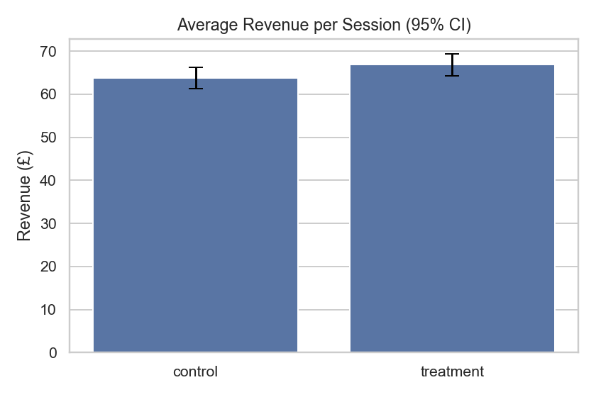
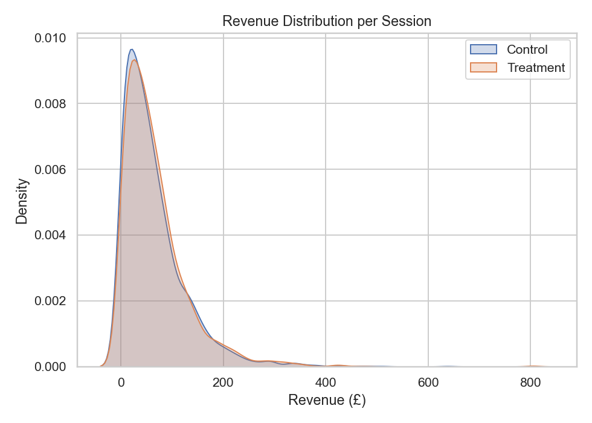
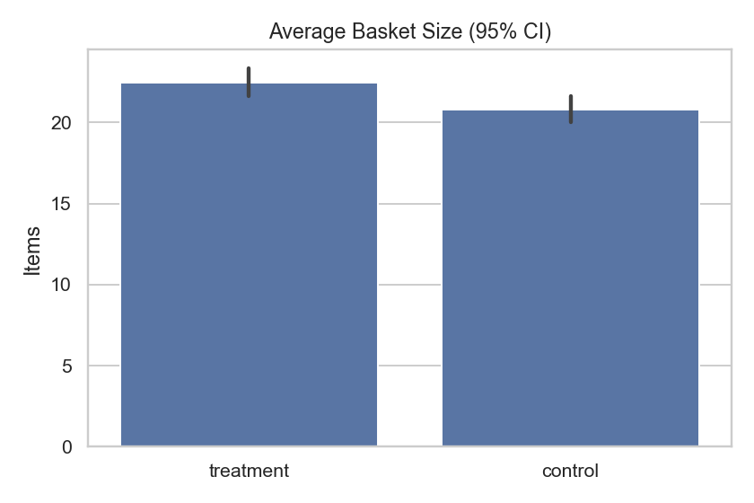
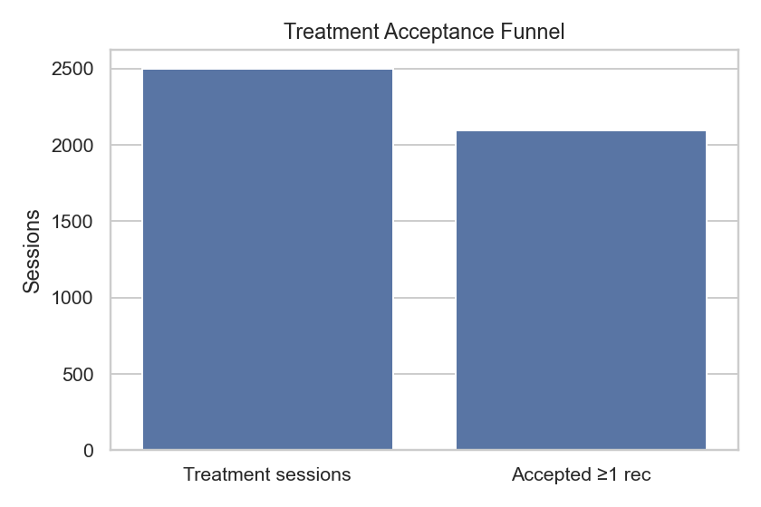
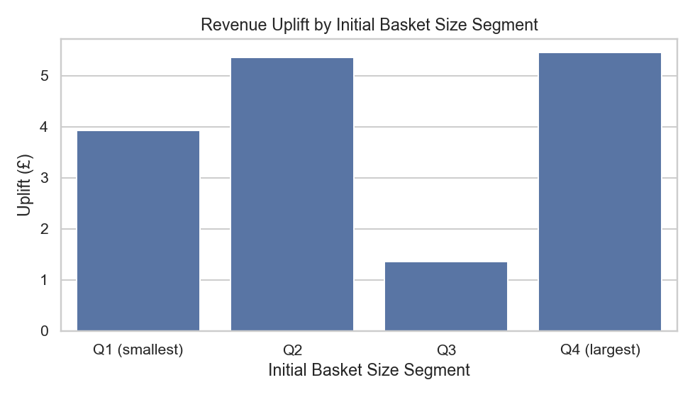

# Market Basket Analysis + Offline A/B Test for E-commerce

This project uses the **Online Retail II** dataset to discover product co-purchase patterns via Market Basket Analysis and simulate an offline A/B test for cart recommendations.

## Objectives
- Identify frequent itemsets & association rules
- Build simple MBA-based recommender
- Compare baseline vs MBA using simulated A/B test
- Generate business insights on cross-selling

## Tech Stack
Python 3.11 | Conda | pandas | mlxtend | matplotlib | scikit-learn | statsmodels | seaborn | Jupyter

## Dataset
[Online Retail II – UCI ML Repository](https://archive.ics.uci.edu/ml/datasets/Online+Retail+II). In this project, after cleaning it:

- Only **United Kingdom** transactions are used  
- Only dates **2010–2011**  
- Cancelled orders removed

## Results

### Key Findings

| Metric | Value |
|-------|-------|
| Average revenue (Control) | £63.79 |
| Average revenue (Treatment) | £66.82 |
| Revenue uplift | **+£3.03 (+4.75%)** |
| 95% CI uplift | (-£0.38, £6.60) |
| p-value | 0.094 |
| Average basket size (Control) | 20.82 |
| Average basket size (Treatment) | **22.44** |
| Basket size uplift | **+1.62 items** |
| Acceptance rate | **83.8%** |
| Mean accepted items | 1.58 |

### Insights

- The recommender increased revenue by **~4.8%**, though not statistically significant at 95% confidence.  
- Basket sizes increased by **1.6 items**, indicating stronger user engagement.  
- Acceptance rate was **very high (83.8%)**, showing that rules provide relevant suggestions.  
- Overall, positive business impact with room for model improvements.

## Figures

#### Average Revenue (95% CI)

  

#### Revenue Distribution (KDE)

  

#### Basket Size Comparison

  

#### Acceptance Funnel

  

#### Uplift by Segment

  

## Future Work

- Add product embeddings (Word2Vec/Doc2Vec)
- Build hybrid recommender (rules + content-based)
- Build Streamlit app for interactive demo
- Deploy API endpoint for recommendations
- Perform hyperparameter tuning on Apriori thresholds

## Acknowledgements

Dataset provided by UCI Machine Learning Repository (Online Retail Dataset).  
This project was completed as a personal data science portfolio project.

